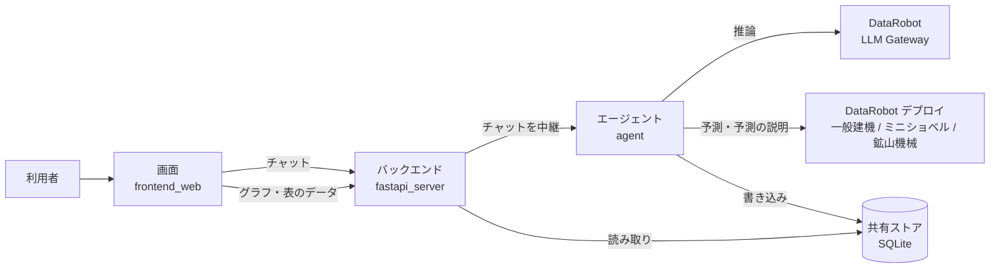

# 建機 長期需要予測・シナリオ分析エージェント

世界の建設機械の需要（一般建機・ミニショベル・鉱山機械）を 10 地域区分で 2050 年まで見通し、
シナリオ比較・要因分解・人による前提補正・経営会議向けの資料化を支援する AI エージェントのデモアプリです。
建機メーカーの経営企画部門（中期経営計画の策定）での利用を想定しています。

> [!IMPORTANT]
> **需要の実績値はデモ用の架空データです。** 人口・GDP などのドライバーは公開データ（世界銀行、Our World in Data）、
> 将来前提は公開の長期シナリオ（SSP、IEA）を参考にした設定値です。実在企業の実績や社内データではありません。

[DataRobot Agentic Starter](https://github.com/datarobot-community/datarobot-agent-application)（LangGraph 版）をベースに作られています。

## 目次

- [できること](#できること)
- [画面構成](#画面構成)
- [仕組み](#仕組み)
- [シナリオと予測の流れ](#シナリオと予測の流れ)
- [事前準備](#事前準備)
- [ローカルサーバー立ち上げ方法](#ローカルサーバー立ち上げ方法)
- [DataRobot へのデプロイ方法](#datarobot-へのデプロイ方法)
- [開発とテスト](#開発とテスト)
- [ディレクトリ構成](#ディレクトリ構成)
- [データと注意事項](#データと注意事項)

## できること

画面右側のチャットでエージェントに話しかけると、DataRobot の予測モデルを呼び出して結果を返し、各ページのグラフや表にも反映します。

| やりたいこと | 話しかける例 |
|---|---|
| 2050 年までの見通しを見る | 「ベースシナリオで2050年までの見通しを見せて」 |
| シナリオを比べる | 「脱炭素加速だと鉱山機械はどう変わる？ベースと比べて」 |
| 前提を変えて試算する（what-if） | 「銅価格が今後10年、年3%ずつ上がったら？」 |
| 数字の理由を知る | 「アフリカの伸びが大きすぎる気がする。なぜ？」 |
| 人の判断で補正する | 「中古機の流入で新車需要が3割減ると想定して補正して。理由は中古機輸入比率の高さ、補正者は経営管理部」 |
| 過去の予測精度を確かめる | 「2005年時点のデータで予測していたら、どこまで読めた？」 |
| 資料にまとめる | 「今日の議論を社長報告用に1枚にまとめて」 |

### 人が判断に介在する仕組み（HILP）

- エージェントは予測を示すたびに結果を自動で点検し、違和感があれば自分から指摘します。対象は、外部予測との大きな乖離、過去に例のない急成長・急減、学習データの範囲外の前提、モデルに含まれていない要因です。
- 指摘は「モデルの根拠」と「モデルが考慮していない要因」を分けて示します。**補正するかどうかは必ず人が決め、エージェントが自分から補正することはありません。**
- 補正には理由と補正者が必須です。補正は判断履歴として保存され、元の予測も残ります。

## 画面構成

6 つのページと、常に表示されるチャットパネルで構成されます。画面はすべて日本語で、台数は千台単位、成長率は 2025 年比の倍率で表示します。

| ページ | 内容 |
|---|---|
| 長期見通しダッシュボード | 地域×機種の需要推移（1995〜2050 年、実績と予測を連続表示）、P10〜P90 の幅、外部予測、2030/2040/2050 年の要約 |
| シナリオ比較 | 4 シナリオと what-if の比較グラフ、2050 年の差分表、前提の調整パネル（GDP 成長率・資源価格・レバー L1〜L4） |
| 要因分解 | 2025 年→目標年の変化を主要ドライバーの寄与に分解した図、同じ所得水準の国の過去事例、モデル外の要因 |
| 過去検証 | 2005 年までのデータで学習したモデルによる 2006〜2025 年の予測と実績の比較 |
| 前提補正と判断履歴 | 検知された違和感の一覧、補正の入力フォーム、補正前後の比較、判断履歴 |
| 経営会議サマリー | 1 枚サマリーのプレビュー、Markdown / PDF のダウンロード |

ページのボタン（再計算、要因分解、補正、サマリー作成）を押すと、チャット経由でエージェントに依頼が送られます。

## 仕組み



| コンポーネント | 役割 |
|---|---|
| エージェント（[agent/](agent/)） | LangGraph のエージェントと 11 種のツール。予測の計算・DataRobot 呼び出し・違和感の検知・補正はすべてここで行います |
| バックエンド（[fastapi_server/](fastapi_server/)） | チャットの中継と、共有ストアを読み取る API（`/api/v1/forecast/*`）。予測の計算はしません |
| 画面（[frontend_web/](frontend_web/)） | React + Vite + Tailwind CSS。6 ページとチャットパネル |
| 共有ストア | 予測（run）、結果、判断履歴、画面用のデータを保存する SQLite ファイル。ローカルでは `.data/forecast_store.sqlite`、デプロイ後は DataRobot 上に保存 |

- LLM は DataRobot LLM Gateway 経由でのみ呼び出します（既定のモデルは `anthropic/claude-sonnet-5`）。外部プロバイダの API キーは使いません。
- 起動時に 4 シナリオのベース予測を計算してキャッシュします。予測リクエストに失敗したときは、キャッシュの結果で表示を続けます。

### エージェントのツール

| ツール | 内容 |
|---|---|
| `list_scenarios` | シナリオの定義とレバーの既定値、作成済みの予測の一覧 |
| `run_forecast` | シナリオの予測を実行。前提を変えると what-if として新しい予測を作成 |
| `compare_scenarios` | 複数の予測の比較 |
| `explain_forecast` | 要因分解、類似の過去事例、モデル外の要因 |
| `detect_forecast_issues` | 違和感の検知 |
| `apply_human_adjustment` | 人の指示による補正の記録と再計算 |
| `get_adjustment_log` | 判断履歴 |
| `get_uncertainty_band` | 予測の幅（P10 / P50 / P90） |
| `get_backtest_result` | 過去検証の結果 |
| `get_external_forecast` | 外部予測（比較用のダミー値） |
| `generate_executive_summary` | 経営会議サマリーの作成 |

## シナリオと予測の流れ

4 つのシナリオは、同じ予測モデルに渡す**将来の入力データ（ドライバー）の前提**だけが異なります。

| シナリオ | 参考にした考え方 | 主な特徴 |
|---|---|---|
| ベース | SSP2 / IEA 現行政策 | 現在の延長線。新興国は緩やかに先進国へ収れん |
| 脱炭素加速 | SSP1 / IEA ネットゼロ | 銅価格が上昇し、石炭生産は急減 |
| 分断世界 | SSP3 | 新興国の収れんが停滞。金は安全資産として上昇 |
| 高成長・化石依存 | SSP5 | 高成長で石炭も長く残り、資源全般が底堅い |

1. **将来ドライバーの作成**（[scenarios.py](agent/agent/forecast/scenarios.py)）：シナリオとレバー L1〜L4 の前提から、38 か国 × 2026〜2050 年の人口・都市化率・1 人当たり GDP・投資比率・石炭生産量・資源価格を作ります。what-if では、前提の上書き（[overrides.py](agent/agent/forecast/overrides.py)）を加えます。
2. **特徴量の作成**：学習時と同じ `build_features()` を使い、18 の特徴量にします。ラグ計算のため、2019〜2025 年の実績を前につなげてから計算します。
3. **予測**（[predictor.py](agent/agent/forecast/predictor.py)）：機種ごとの DataRobot デプロイにリアルタイム予測をリクエストします。返ってくる値は人口 100 万人あたりの販売台数です。
4. **後処理**：台数への換算、起点補正（2025 年実績から滑らかにつなぐ）、学習範囲を超える資源価格の補正（鉱山機械）、自動化レバー L1、人による補正を順に適用します。

## 事前準備

- DataRobot のアカウントと API キー（このデモは `https://app.jp.datarobot.com` で動作確認しています）
- 3 機種の予測モデルのデプロイ。[agent/demo_assets/build_and_deploy.py](agent/demo_assets/build_and_deploy.py) で作成できます。
- `agent/demo_assets/deployments.json`：[deployments.example.json](agent/demo_assets/deployments.example.json) をコピーして、実際の ID に置き換えます（`build_and_deploy.py` を実行すると自動で作成されます）。このファイルは Git の管理対象外です。

| キー | 使い道 | ないとどうなるか |
|---|---|---|
| `deployment_id`（必須） | 予測と予測の説明のリクエスト先 | その機種は「準備中」と表示され、予測されません |
| `project_id`・`model_id`（推奨） | 予測の幅に使うホールドアウト誤差の取得、予備の要因分解 | 予測はできますが、予測の幅は既定の誤差率で計算されます |

`deployment_id` はランタイムパラメータ `DEPLOYMENT_ID_GENERAL` / `DEPLOYMENT_ID_MINI` / `DEPLOYMENT_ID_MINING` でも指定できます。

## ローカルサーバー立ち上げ方法

> 必要なツール（DataRobot CLI、Task、uv、Node.js など）の導入方法や、コマンドの詳しい説明は
> [DataRobot Agentic Starter の README](https://github.com/datarobot-community/datarobot-agent-application#quick-start) を参照してください。
> このリポジトリには Dev Container の設定も含まれています（`.devcontainer/`）。

**1. 開発環境の準備（初回のみ）**

```sh
dr start
```

対話形式で `.env`（DataRobot のエンドポイントと API キー、LLM の設定など）が作成され、依存関係がインストールされます。
あとから環境変数を変える場合は `dr dotenv setup` を使います。

**2. すべてのサービスを起動**

```sh
dr run dev
```

画面・バックエンド・エージェント・MCP サーバーが並行して起動します。起動後、エージェントが 4 シナリオのベース予測を計算します（1〜2 分）。

**3. ブラウザで開く**

[http://localhost:5173](http://localhost:5173) を開き、右側のチャットで話しかけてください。

| ポート | サービス |
|---|---|
| 5173 | 画面（Vite 開発サーバー） |
| 8080 | バックエンド |
| 8842 | エージェント |
| 9000 | MCP サーバー |

**データを初期化したいとき**

サーバーを止めて `.data/forecast_store.sqlite` を削除します。次の起動時に、4 シナリオのベース予測だけで作り直されます。
what-if と判断履歴も消えるので注意してください。

**過去検証を表示したいとき**

[agent/demo_assets/run_backtest.py](agent/demo_assets/run_backtest.py) を実行すると `data/backtest_predictions_*.csv` が作成され、次回起動時から「過去検証」ページに表示されます。
DataRobot 上でモデルの学習が走るため、時間とリソースを消費します。

## DataRobot へのデプロイ方法

> デプロイの仕組み（Pulumi）や出力の見方、トラブルシューティングは
> [DataRobot Agentic Starter の README](https://github.com/datarobot-community/datarobot-agent-application#deploy-your-agent) を参照してください。

`dr run dev` で確認した状態のまま、ファイルを編集せずに `dr run deploy` でデプロイできます。
共有ストアの保存先は実行環境に応じて自動で切り替わります。

| 実行環境 | 共有ストアの保存先 |
|---|---|
| `dr run dev` | ローカルの `.data/forecast_store.sqlite` |
| `dr run deploy` | DataRobot 上（エージェントのデプロイに紐づく Files API と Key-Value）。エージェントが書き込み、アプリが読み取ります |

デプロイ前に、`.env` に次の値が設定されていることを確認してください。

- `DATAROBOT_API_TOKEN`、`DATAROBOT_ENDPOINT`
- `PULUMI_CONFIG_PASSPHRASE`
- `SESSION_SECRET_KEY`
- （任意）`DEPLOYMENT_ID_GENERAL` / `DEPLOYMENT_ID_MINI` / `DEPLOYMENT_ID_MINING`：設定すると、デプロイしたエージェントに渡されます。未設定なら `agent/demo_assets/deployments.json` が使われます

```sh
dr run deploy
```

デプロイには数分かかります。完了するとアプリの URL などが表示されます。
デプロイ後にエージェントを確認するには、次を実行します。

```sh
dr task run agent:cli -- -- execute-deployment --user_prompt "ベースシナリオで2050年までの見通しを見せて" --deployment_id <デプロイID>
```

## 開発とテスト

```sh
dr task run agent:lint          # エージェント
dr task run agent:test
dr task run fastapi_server:lint # バックエンド
dr task run fastapi_server:test
dr task run frontend_web:lint   # 画面
dr task run frontend_web:test
```

- 違和感の検知の閾値は [analysis.py](agent/agent/forecast/analysis.py) の先頭に定数としてまとめています。
- `agent/agent/forecast/features.py` と `postprocess.py` は、学習時と同じロジックを保つため `agent/demo_assets/` の同名ファイルと同一の内容にしています（テストで確認しています）。lint の自動整形の対象外です。
- コンポーネントごとの開発ルールは [AGENTS.md](AGENTS.md) にあります。

## ディレクトリ構成

```
agent/                  エージェント（LangGraph）
  agent/myagent.py        エージェントの定義とシステムプロンプト
  agent/tools.py          11 種のツール
  agent/forecast/         予測エンジン（シナリオ、上書き、予測、後処理、分析、共有ストア）
  demo_assets/            データ（CSV）とモデル構築・予測・過去検証のスクリプト
  tests/
fastapi_server/         バックエンド（FastAPI）
  app/api/v1/forecast.py  画面向けの予測データ API
  app/forecast/           共有ストアの読み取り
frontend_web/           画面（React + Vite + Tailwind CSS）
  src/pages/forecast/     6 つのページ
  src/components/forecast/  共通レイアウト・チャットパネル・グラフ部品
infra/                  DataRobot へのデプロイ（Pulumi）
mcp_server/             MCP サーバー（テンプレート既定）
agent_spec.md           エージェントの仕様
```

## データと注意事項

- 需要の実績値（`04`・`05` の CSV）はデモ用の架空データです。外部予測（`10` の CSV）も比較用の架空の値です。
- 予測の幅（P10〜P90）は不確実性の目安であり、確率を保証するものではありません。
- 過去検証は、前提（人口・GDP など）に実際の値を使った検証です。モデルの構造の妥当性を示すもので、将来の前提そのものの不確実性は含みません。
- 次のものは Git の管理対象外です：`.env`（API キー）、`agent/demo_assets/deployments.json`（実際のデプロイ ID）、`.data/`（共有ストア・チャット履歴）。

## ライセンス

ベースの DataRobot Agentic Starter は Apache License 2.0 で公開されています。詳しくは [LICENSE.txt](LICENSE.txt) を参照してください。
